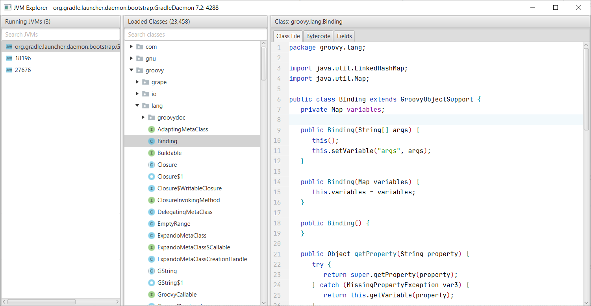
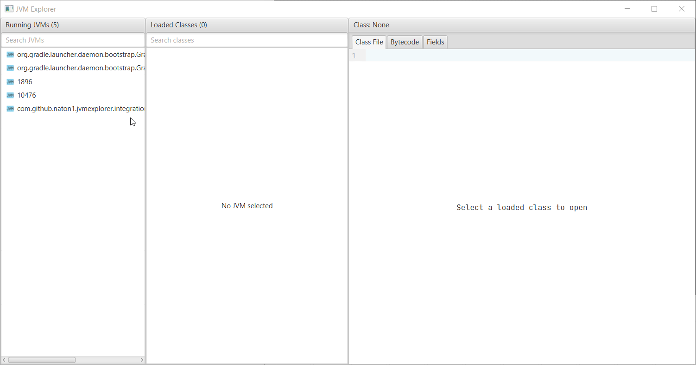
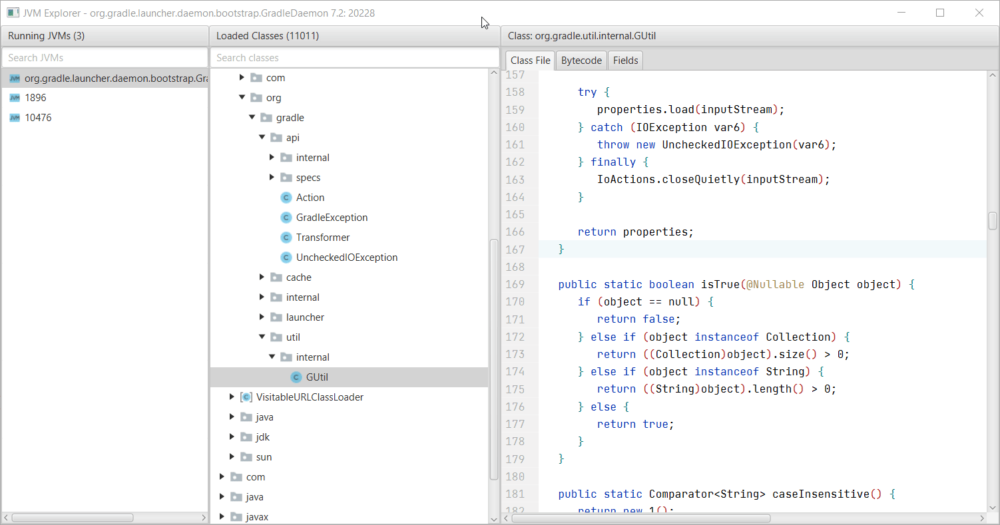
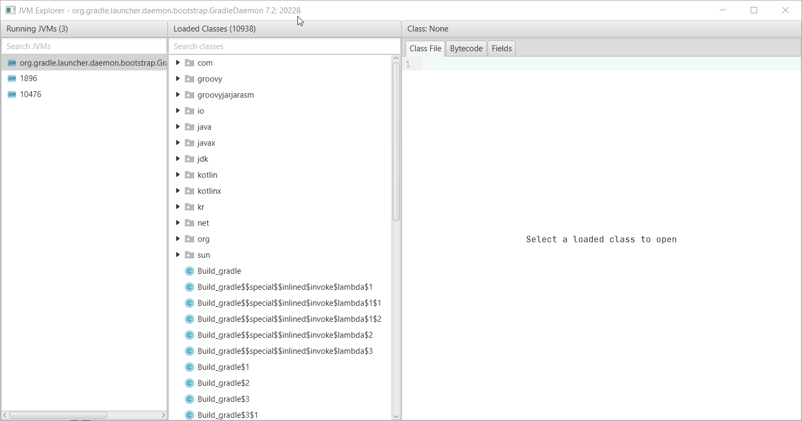
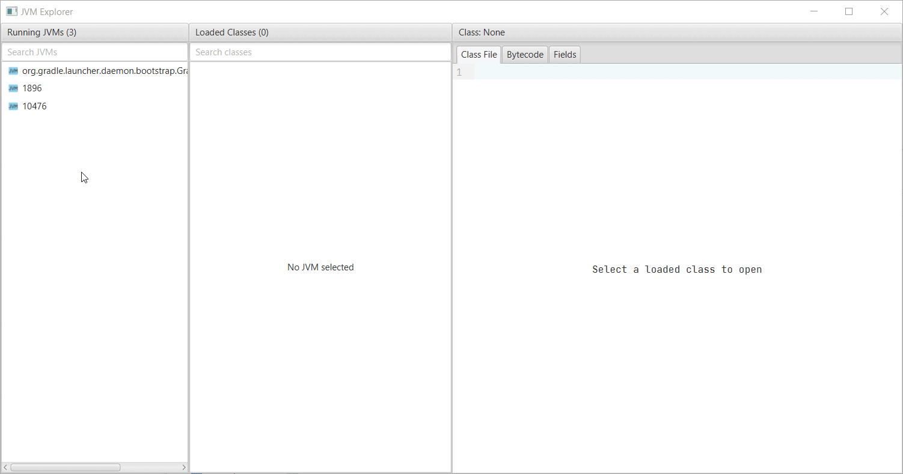
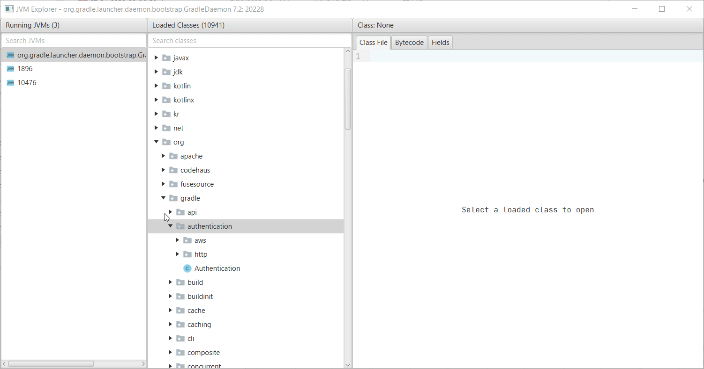
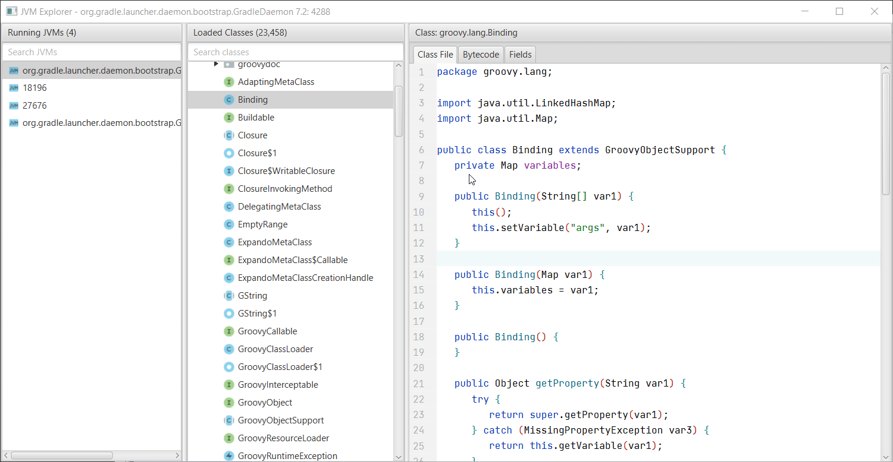
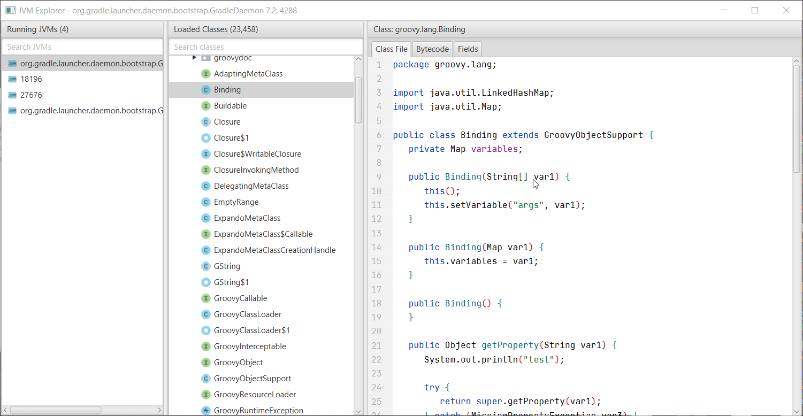
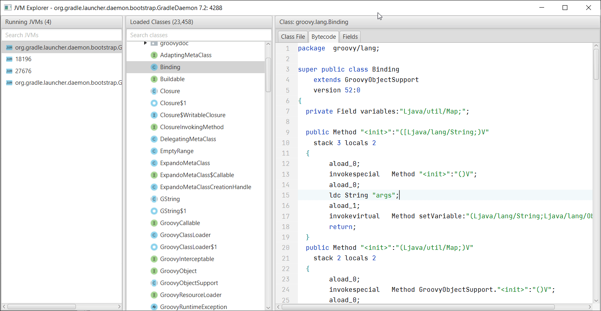

# JVM Explorer

> This project is forked from [Naton1/jvm-explorer](https://github.com/Naton1/jvm-explorer). Thanks to the original author for the great work.

JVM Explorer is a Java desktop application for browsing loaded class files inside locally running Java Virtual Machines.



## Features

* Browse local JVMs
* View all classes inside each JVM
* Search to find specific classes (supports regex)
* View classloader hierarchy
* View decompiled bytecode
* View disassembled bytecode
* Re-assemble bytecode
* Re-compile class file
* Modify method implementations (insert, replace method body with java code)
* Execute code in local JVMs
* Export loaded classes to a JAR file
* Browse the state of all static variables in a class (and their nested fields)
* Modify the state of static variables (and their nested fields)
* Replace class file definitions
* View system properties of running JVMs
* Run JAR files with a patched `ProcessBuilder` to remove any `-XX:+DisableAttachMechanism` argument

### Demos

<details>
  <summary>Browse Classes And Fields</summary>

Notes:

* Ctrl + Click on a class name in the class file viewer to open it
* Search and press enter to open a class with the specified name
* Edit a field value (under Fields tab) through Right Click -> Edit - only works for primitives and Strings


</details>

<details>
  <summary>Execute Code In Remote JVM</summary>

<br/>

Notes:

* You can call methods in the remote classes - the loaded classes are used for the compiler classpath


</details>

<details>
  <summary>Show Class Loader Hierarchy</summary>

<br/>


</details>

<details>
  <summary>Launch Jar With Patched ProcessBuilder</summary>

<br/>


</details>

<details>
  <summary>Export Classes In Package</summary>

<br/>


</details>

<details>
  <summary>Modify Method</summary>

<br/>

Notes:

* You can insert code to the beginning of a method or replace the entire method body
* The compiler currently uses the loaded classes as the classpath, so if a parameter type or return type isn't loaded,
  it may fail (you can replace the type with Object to make it compile if you don't need that type)
* To access fields in the class, add a field with the same name and type in the class to compile - the reference will
  automatically be replaced


</details>

<details>
  <summary>Modify Class</summary>

<br/>

Notes:

* Ctrl+S to re-recompile and patch class (or Right-Click -> Save Changes)
* Often, decompiled code is not valid Java code, so it may not compile in some cases - the modify method feature is the
  workaround for this
* The compiler currently uses the loaded classes as the classpath, so if some required type isn't loaded, it may fail


</details>

<details>
  <summary>Modify Bytecode</summary>

<br/>

Notes:

* Ctrl+S to re-assemble and patch class (or Right-Click -> Save Changes)
* The disassembler/assembler isn't perfect - it works most of the time but struggles with some cases (it uses OpenJDK
  AsmTools)


</details>

## Getting Started

There are two ways to run the application. Download a provided platform-specific package, or build and run it yourself.
This application requires **Java 21+** and can attach to JVMs running Java 7+.

### Download Package:

1) Download a platform-specific package from [the latest release](https://github.com/unknowIfGuestInDream/jvm-explorer/releases/latest)
2) Extract the archive and run the startup script for your platform

### Build And Run:

1) Clone with Git

```bash
git clone https://github.com/unknowIfGuestInDream/jvm-explorer.git
```

2) Change into the project directory

```bash
cd jvm-explorer
```

3) Build with Maven (Java 21+, Maven 3.9+)

```bash
mvn clean install -DskipTests
```

4) Run the application

```bash
mvn -pl explorer javafx:run
```

## Troubleshooting

Two logs files `application.log` and `agent.log` are created at `[User Home]/jvm-explorer/logs`

* Must run the application with a Java version of at least Java 21
* Must attach to a JVM running a Java version of at least Java 7
* Must attach to a JVM running the same architecture - a 32-bit JVM must attach to a 32-bit JVM
* May have to attach to a JVM that the same user started
* Must attach to a JVM that supports the Java Attach API
* If you run an old version of this application and attach it to a JVM, then update to a newer version and try to
  re-attach, the agent will be outdated. If there are changes in the client-server protocol, the agent will fail.
  Restart the target JVM to fix this.

Note: this uses the Java Attach API so any limitations will apply here.

## Project Principles

* Maintain a simple and easy-to-use interface
* Take advantage of attaching to running JVMs - this is not a traditional GUI decompiler

## Project Structure

| Module         | Description                                  |
|----------------|----------------------------------------------|
| `protocol`     | Shared protocol classes for communication    |
| `agent`        | JVM agent injected into target processes     |
| `launch-agent` | Launch patch agent for JDK compatibility     |
| `explorer`     | JavaFX desktop application (main module)     |

## License

This project is licensed under the MIT License - see the [LICENSE](LICENSE) file for details.
